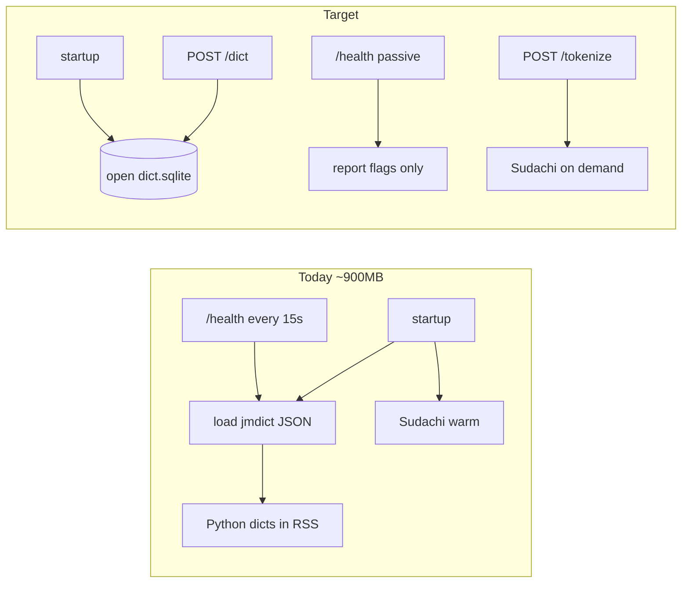

<!-- date: 2026-08-01 -->
<!-- source: chat:a75dade4 (Translate) · user: Viết ra plan riêng -->

---
name: Bridge RAM SQLite
overview: "Corrected local-bridge RAM plan: SQLite dict backend, stop health/startup auto-load, measure in Docker, promote to host. Host stays primary; Docker is the RSS harness only."
todos:
  - id: baseline-rss
    content: Record live docker stats baseline (~896MiB); free :8765 before rebuild
    status: completed
  - id: build-dict-sqlite
    content: Add scripts/build_dict_sqlite.py → data/dict/dict.sqlite from existing JSON
    status: completed
  - id: dictionary-sqlite
    content: Point dictionary.py lookups at SQLite; keep _SEED_JA_VI in memory
    status: completed
  - id: passive-health-startup
    content: Passive /health; startup opens DB+freq only, no JSON parse, no warm Sudachi
    status: completed
  - id: docker-measure
    content: Rebuild compose; verify idle <150MB, active <400MB; set mem_limit ~512m
    status: completed
  - id: smoke-ext
    content: POST /tokenize /dict /scripts/save + one YouTube extension pass
    status: completed
  - id: promote-host
    content: Merge to host branch; confirm ./start.sh footprint; skip SKIP_SAVED_ITEMS unless asked
    status: completed
isProject: false
---

# Bridge RAM: SQLite + passive load

Status: **xong** (verified disk 2026-08-07 — `dictionary.py` SQLite, `build_dict_sqlite.py`, passive `/health`, Sudachi lazy in `tokenize_ja.py`, `mem_limit: 512m`, `tests/test_sqlite_parity.py`).

## Defaults (locked)

- **Runtime:** host remains primary (`./start.sh` / LaunchAgent). Docker is only for RSS / `mem_limit` measurement.
- **Ceiling:** idle **&lt;150MB** with dict on SQLite and **Sudachi not warm**; active (after first `/tokenize`) **~250–400MB**. Hard `&lt;100MB` while Sudachi is loaded is rejected as unrealistic (`sudachidict_core` ~207MB on disk).
- **Skip:** JSON-only lazy phase, `gc.collect()` theater, idle process exit, coupling `SKIP_SAVED_ITEMS` to this work.

## Why Antigravity’s plan needed a rewrite

Live container already proves the baseline:

- `yt-caption-bridge` = **896 MiB** (from host compose path, not worktree).
- Two load triggers, not one: `/health` *and* `on_startup` warm-load in [`local-bridge/main.py`](local-bridge/main.py).
- Worktree at `/Users/hoangson/Documents/Translate-realtime-OCR-worktree` is missing `jmdict_mini.json` / `jmdict_vi.json` and is behind `dev` — do not treat it as the source of truth for data or isolation.
- Prefix match only probes ≤16 exact keys ([`_longest_prefix_match`](local-bridge/dictionary.py)) → SQLite `EXISTS`/PK lookups are enough; no need to keep 464k keys in RAM.



## Scope (fewest files)

| File | Change |
|---|---|
| [`local-bridge/scripts/build_dict_sqlite.py`](local-bridge/scripts/build_dict_sqlite.py) | **NEW** — one-shot compiler JSON → `data/dict/dict.sqlite` |
| [`local-bridge/dictionary.py`](local-bridge/dictionary.py) | SQLite-backed `load_dictionary` / `_has_key` / `_senses_for_key` / VI+EN lookups; keep `_SEED_JA_VI` in memory |
| [`local-bridge/main.py`](local-bridge/main.py) | Passive `/health`; startup opens SQLite + loads freq only — **do not** warm Sudachi or parse JSON |
| [`local-bridge/docker-compose.yml`](local-bridge/docker-compose.yml) | After measure, set `mem_limit` to a floor that survives Sudachi active (likely **512m**, not 256m) |
| One small assert/self-check | Lookup parity for a few fixed keys (猫, etc.) vs old JSON if present |

No new deps (`sqlite3` stdlib). No idle GC worker. No new `/gc` endpoint.

## Schema (boring)

One DB file `data/dict/dict.sqlite`:

- `jmdict(expression TEXT PRIMARY KEY, payload TEXT NOT NULL)` — `payload` = JSON list of entries (same shape `_senses_for_key` already reads).
- `javi(expression TEXT PRIMARY KEY, glosses TEXT NOT NULL)` — JSON list.
- `jmdict_vi(expression TEXT, reading TEXT, glosses TEXT, PRIMARY KEY(expression, reading))`.
- `en_vi(lemma TEXT PRIMARY KEY, glosses TEXT NOT NULL)` — lemma lowercased.

Build script reads existing JSON once; runtime never `json.loads` the big files.

## Execution phases

### 1. Baseline (host Docker already running)

```bash
docker stats --no-stream yt-caption-bridge   # expect ~896MiB
curl -fsS http://127.0.0.1:8765/health
```

Work on branch `dev` (or short `feature/bridge-ram-sqlite` from current `dev`). Prefer **this workspace**; copy/share `data/dict` if using the worktree. Stop the existing container before rebuild so port 8765 is free.

### 2. Code: passive health + SQLite

1. `/health`: report `dict_loaded()` / sudachi / freq — **never** call `load_dictionary()`.
2. `on_startup`: open SQLite connection (and `load_freq()`); remove `load_dictionary()` JSON parse and `load_tokenizer()`.
3. `load_dictionary()` becomes “ensure DB connection + seed overlay”; `_has_key` / `_senses_for_key` / `_vi_glosses_for` / `_en_vi` query SQLite.
4. Build `dict.sqlite` once; mount via existing `./data` volume (`.dockerignore` already excludes `data/`).

### 3. Measure in Docker

```bash
cd local-bridge && docker compose up --build -d
# idle (before any /tokenize)
docker stats --no-stream yt-caption-bridge
curl -fsS -X POST http://127.0.0.1:8765/dict -H 'content-type: application/json' -d '{"surface":"猫"}'
curl -fsS -X POST http://127.0.0.1:8765/tokenize -H 'content-type: application/json' -d '{"text":"猫が好き"}'
docker stats --no-stream yt-caption-bridge
```

Pass criteria:

- Idle (no Sudachi yet): **&lt;150MB**
- After `/dict` only: still **&lt;150MB**
- After `/tokenize`: **&lt;400MB**, lookups still correct
- Then try `mem_limit: 512m`; only try lower if active RSS allows

### 4. Extension smoke

Against `127.0.0.1:8765`: `POST /tokenize`, `POST /dict`, `POST /scripts/save`, then one YouTube hardsub session (furigana + hover dict).

### 5. Promote to host

Merge to `dev`/`main`. Host `./start.sh` picks up the same code; no LaunchAgent change required for RAM. `SKIP_SAVED_ITEMS=1` stays optional and unrelated.

## Explicitly not doing

- JSON lazy-load as an intermediate milestone
- `gc.collect()` / idle-exit background worker
- Rewriting Sudachi / swapping tokenizer
- Making Docker the daily runtime (unless you ask later)
- Treating the incomplete worktree as the only sandbox without copying dict data
