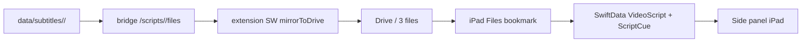

<!-- date: 2026-08-02 -->
<!-- source: chat:ae91f185 · user: check lại plan xem có hợp lý chưa -->

---
name: Drive folder mirror
overview: Chuyển sync script sang mirror nguyên folder từng video lên Drive (cues.json/meta.json/script.txt), bỏ đường snapshot lossy làm mất cờ owned; iPad quét folder Drive và tự nạp script vào side panel.
todos:
  - id: cleanup-dead-dirs
    content: Merge lqa-pfb_9Ag + Yq-VtKiJbLk + bFnjydmGL3k vào data/subtitles, rồi xóa root scripts/, root web/, yjcs/scripts/<videoId>/, tmp-ime-evidence/, ipad-app/build/, heapsnapshot; root local-bridge/ chỉ xóa sau khi xác minh mtime không đổi
    status: completed
  - id: bridge-files-api
    content: "Bridge: gộp legacy scripts/ vào data/subtitles, lưu owned vào meta.json, thêm GET /scripts + GET/POST /scripts/{id}/files, apply_snapshot chỉ còn vocab"
    status: completed
  - id: ext-mirror
    content: "Extension SW: mirrorToDrive / mirrorFromDrive theo subfolder <videoId> với 3 file; nút Upload Drive và debounce dùng mirror"
    status: completed
  - id: ext-owned-fix
    content: "content.js: owned lấy từ disk meta, DRIVE_RESTORED không xoá meta, giữ nguyên gate owned trong onNavigate"
    status: completed
  - id: rev-freshness
    content: rev Lamport + deviceId trong meta.json/chrome.storage/Drive; loadCachedCues và saveTranscript chọn theo rev; panel hiện nguồn·rev·thời gian + nút refresh
    status: completed
  - id: perf-slim
    content: Tách tokens.json khỏi cues.json (1.17MB -> 144KB), GET /scripts/{id}/meta so rev trước khi fetch body, script.txt sinh khi mirror/export, Drive upload theo idle 5s + rev
    status: completed
  - id: ipad-drive-scripts
    content: "iPad: DriveScriptsService quét folder Drive, import cues.json qua parseImportJSON, auto sync theo videoID + nút Drive, ghi ngược patch cues.json + bump rev"
    status: completed
  - id: verify-deploy
    content: Chạy smoke bridge, restart bridge, kiểm tra Upload Drive thấy folder trên Drive, build + deploy iPad qua deploy-ipad.sh
    status: completed
isProject: false
---

# Mirror folder script lên Drive + iPad tự nạp

## Nguyên nhân gốc của bug hiện tại

1. **Drive không có script** vì extension chỉ upload đúng một file `caption-studio-backup.json`, không hề upload folder video nào.
2. **Side panel không nạp script đã lưu** vì cờ `owned` chỉ sống trong `chrome.storage`:
  - `meta.json` trên đĩa không lưu `owned` (chỉ có `video_id/url/title/updated_at/cue_count/translated_count`).
  - Handler `DRIVE_RESTORED` xoá `transcriptMeta:{id}` khỏi chrome.storage.
  - `onNavigate` chỉ bỏ qua YouTube khi `transcriptMeta.owned === true`:

```3297:3311:youtube-jp-caption-studio/extension/content/content.js
    if (restored && transcriptMeta.owned) {
      // Heal chrome.storage if a poor YT auto-save was shadowing disk.
      void saveTranscript({ force: true });
      ...
      return;
    }
    const ready = await waitForPageBridge(2500);
    ...
    await loadAllCaptions(true, { bridgeReady: ready });
```

   Mất `owned` → luôn rơi xuống nạp lại từ YouTube.
3. **Snapshot là lossy**: `apply_snapshot` ghi đè `cues.json` chỉ với start + text, mất `tokens`, `mt_locked`, `translation_source: "import"` — chính các trường quyết định `isOwnedCue`. Mỗi lần pull Drive là một lần hạ cấp script local.
4. `data/subtitles/` mới là thư mục thật của bridge; `scripts/` là bản cũ còn 2 video (`Yq-VtKiJbLk`, `bFnjydmGL3k`) chưa bao giờ được sync.

## Layout mới trên Drive

Trong folder `1K8LPtKici0gVaq5FuTMDmYDWzPpBokFA`:

```
MOIbaNe4Pmw/cues.json      (~144KB, KHÔNG tokens; giữ en/vi/mt_locked/translation_source)
MOIbaNe4Pmw/meta.json      (owned, rev, deviceId, updated_at)
MOIbaNe4Pmw/script.txt     (đọc tay được; sinh khi mirror/export)
EiISOvl2_tQ/...
caption-studio-backup.json (chỉ còn vocab)
```

`tokens.json` **chỉ nằm local**, không lên Drive: tokens là dữ liệu dẫn xuất từ Sudachi, máy khác tái tạo bằng `/tokenize_batch`, còn iPad không có trường `tokens` nên không dùng tới. Nhờ vậy phần lên Drive nhẹ đi 8 lần.




## 0. Xóa folder thừa (trước/cùng lúc gộp)

Bridge chỉ dùng `youtube-jp-caption-studio/data/subtitles/`. Các path dưới đây là bản sao / rác — **xóa** khi implement:


| Path                                                                                                               | Lý do xóa                                              | Size  |
| ------------------------------------------------------------------------------------------------------------------ | ------------------------------------------------------ | ----- |
| `[scripts/](scripts/)` (root monorepo)                                                                             | Bản script cũ — **merge `lqa-pfb_9Ag` trước**          | ~1.3M |
| `[web/](web/)` (root)                                                                                              | Stub rỗng; web thật ở `youtube-jp-caption-studio/web/` | ~16K  |
| `youtube-jp-caption-studio/scripts/<videoId>/`                                                                     | Legacy sau khi merge → `data/subtitles/`               | ~1.7M |
| `[youtube-jp-caption-studio/tmp-ime-evidence/](youtube-jp-caption-studio/tmp-ime-evidence/)` + `tmp-ime-*.html/py` | Evidence tạm IME                                       | ~656K |
| `[ipad-app/build/](ipad-app/build/)`                                                                               | Artifact Xcode (đã gitignore)                          | ~374M |
| `baseline.heapsnapshot`, `target.heapsnapshot` (root)                                                              | File debug heap, không phải source                     | ~31M  |


**Cần xác minh trước khi xoá** — `[local-bridge/](local-bridge/)` ở root (~4.2M): nhìn thì stale (chỉ có `data/`, không có code), nhưng `local-bridge/data/extension_state.json` có mtime **hôm nay 11:38** nên vẫn có thứ gì đó ghi vào. Quy trình: restart bridge thật → dùng app ~1 phút → nếu mtime không đổi thì xoá; nếu đổi thì tìm process ghi (`lsof`) và sửa path trước.

Video cần merge vào `data/subtitles/` trước khi xoá thư mục nguồn: `lqa-pfb_9Ag` (chỉ có ở root `scripts/`), `Yq-VtKiJbLk` + `bFnjydmGL3k` (chỉ có ở `yjcs/scripts/`).

**Giữ:**

- `youtube-jp-caption-studio/data/subtitles/` — nguồn sự thật script
- `youtube-jp-caption-studio/scripts/{build_freq_ja.py,cue_timing_sanity.js,normalize_cues_sanity.js,.gitkeep}` — util, không phải video folder
- `ipad-app/Scripts/` — deploy/renew (cần)
- `youtube-jp-caption-studio/local-bridge/` — bridge thật
- `.agents/`, `.cursor/` — tooling agent/IDE

Thứ tự: merge `scripts/<videoId>` thiếu (`Yq-VtKiJbLk`, `bFnjydmGL3k`) vào `data/subtitles/` → rồi mới xoá video folder legacy.

## 1. local-bridge

`local-bridge/app/services/script_store.py` + `main.py`:

- Gộp một lần thư mục cũ: copy `youtube-jp-caption-studio/scripts/<videoId>/` sang `data/subtitles/<videoId>/` **chỉ khi đích chưa tồn tại** (không đè bản mới); sau đó xoá các subfolder video legacy như mục 0.
- `save_script` nhận và ghi `owned` vào `meta.json`; `GET /scripts/{id}` trả `owned`.
- Route mới:
  - `GET /scripts` → `[{video_id, title, updated_at, cue_count, owned}]`
  - `GET /scripts/{id}/files` → `{files: {"cues.json": "...", "meta.json": "...", "script.txt": "..."}}`
  - `POST /scripts/{id}/files` → ghi thẳng 3 file (chiều Drive → PC, không qua snapshot)
- `snapshot.py`: `apply_snapshot` **chỉ còn áp vocab**, không đụng `data/subtitles` nữa (script đi đường mirror). Giữ `encode_snapshot` cho vocab.

## 2. Chrome extension

`extension/background/service_worker.js`:

- `mirrorToDrive(videoIds?)`: với mỗi video → tìm/tạo subfolder tên `<videoId>` (`mimeType: application/vnd.google-apps.folder`, parent = `DRIVE_FOLDER_ID`) → upload 3 file (create multipart / update `uploadType=media`). Bỏ qua nếu `meta.updated_at` trùng `chrome.storage.driveMirror[videoId]`.
- `mirrorFromDrive()`: liệt kê subfolder trên Drive, video nào có `cues.json` mới hơn bản local → `POST /scripts/{id}/files`.
- Nút **Upload Drive** → `mirrorToDrive()` toàn bộ; debounce sau `/scripts/save` → mirror riêng video đó.
- `pullDriveIfNewer` chỉ còn xử lý vocab từ snapshot, phần script gọi `mirrorFromDrive()`.

`extension/content/content.js`:

- `loadTranscriptMeta` lấy `owned` từ disk meta khi chrome.storage trống; `saveTranscript` gửi kèm `owned` lên `/scripts/save`.
- `DRIVE_RESTORED` không xoá `transcriptMeta` nữa, chỉ xoá `transcript:{id}` rồi `tryApplySavedScript`.
- **Giữ nguyên** điều kiện `if (restored && transcriptMeta.owned)` trong `onNavigate`. Bỏ hẳn nhánh nạp YouTube sẽ làm script YT lưu dở (mới tải 30%) không bao giờ được bổ sung cue thiếu. Bug thật là `owned` bị mất, nên chỉ cần làm `owned` bền là đủ — đây mới là fix đúng gốc, diff nhỏ hơn.

## 2b. Đảm bảo side panel luôn nạp bản mới nhất (`rev`)

Hiện không nơi nào biết bản nào ghi sau; mọi lựa chọn dựa trên độ giàu:

```702:707:youtube-jp-caption-studio/extension/content/content.js
  function scriptListScore(list) {
    let s = 0;
    for (const c of list || []) s += cacheCueScore(c);
    s += (list || []).length * 0.25;
    return s;
  }
```

Hệ quả: mọi thao tác **xoá bớt** (xoá cue, xoá bản dịch) đều thua bản cũ giàu hơn và bị hồi sinh.

**Đồng hồ Lamport, không dùng wall clock.** Đồng hồ Mac và iPad lệch nhau, còn mtime trên Drive/Files là lúc sync chứ không phải lúc sửa.

- Thêm `rev` (int) + `deviceId` (chuỗi ổn định mỗi máy) vào cả ba nơi: `data/subtitles/<id>/meta.json`, `chrome.storage transcriptMeta:{id}`, `<videoId>/meta.json` trên Drive; iPad giữ trong SwiftData `VideoScript.rev` + `deviceId`.
- Ghi: `rev = max(mọi rev đã thấy) + 1`.
- Đọc: chọn `rev` lớn nhất. Bằng nhau mới dùng `scriptListScore`; hoà tiếp thì so `deviceId` cho xác định.

**Chỉ sửa một cửa.** Mọi đường nạp đều qua `loadCachedCues()` (`tryApplySavedScript`, `applyLoadedCues`, `onNavigate` đều gọi vào đây) → đổi hàm này sang chọn theo `rev`. Hai guard trong `saveTranscript` (dòng ~875 và ~891) đổi từ so `scriptListScore` sang so `rev`: chỉ chặn khi `rev` đến vào nhỏ hơn `rev` đang có.

**Freshness lúc mở panel / chuyển video.** Render bản đĩa ngay (không chờ mạng), rồi bất đồng bộ đọc `<videoId>/meta.json` trên Drive; nếu `rev` lớn hơn thì `mirrorFromDrive(videoId)` rồi thay tại chỗ. Cache kết quả kiểm tra ~10s để không gọi Drive mỗi lần navigate.

**Hiển thị.** Thêm dòng nhỏ trên side panel: `disk · rev 12 · 2 phút trước` + nút refresh, để bản cũ không im lặng.

## 2c. Tối ưu load và save

Đo trên `MOIbaNe4Pmw`: `cues.json` 1.17 MB, riêng `tokens` chiếm **567 KB (48.5%)**; bỏ tokens còn **144 KB**. Mỗi lần sửa một dòng VI hiện tốn ~1.17 MB ghi `chrome.storage` + ~1.17 MB HTTP + 1.17 MB ghi đĩa + 115 KB `script.txt`. Mỗi lần chuyển video, `loadCachedCues` parse **hai** bản 1.17 MB rồi mới merge.

**a. Tách `tokens.json`.** `save_script` ghi `cues.json` không kèm `tokens` và `tokens.json` dạng `{cueId: [...]}`. `GET /scripts/{id}` trả bản không tokens; thêm `GET /scripts/{id}/tokens` để content.js nạp sau. Payload `chrome.storage` cũng bỏ `tokens` (dòng 859 trong `content.js`). Migration: khi đọc file cũ còn tokens inline thì tách và ghi lại một lần.

**b. So `rev` trước khi fetch.** Thêm `GET /scripts/{id}/meta` (vài trăm byte: `rev`, `deviceId`, `updated_at`, `cue_count`, `owned`). `loadCachedCues` đọc meta của chrome.storage và của bridge, chọn bên `rev` lớn hơn, rồi **chỉ** tải body của bên thắng. Đường thường không còn `mergeCacheLists`; chỉ merge khi `rev` bằng nhau.

**c. Hoãn `script.txt`.** `save_script` không sinh nữa. Sinh trong `GET /scripts/{id}/files` (lúc mirror) và lệnh export — một đường code duy nhất, bỏ hẳn 115 KB ghi mỗi lần sửa.

**d. Upload Drive theo idle + `rev`.** Debounce 1.5s → **5s rảnh**; bỏ qua nếu `rev` bằng `lastMirroredRev[videoId]` trong `chrome.storage`. Kết hợp với (a) thì mỗi lần upload chỉ còn ~144 KB.

Cả bốn đều đi qua `rev`, nên bản đẩy lên Drive vẫn đúng là bản mới nhất.

## 3. iPad app

`ipad-app/Services/DriveScriptsService.swift` (mới, nhỏ):

- Dùng lại bookmark folder sẵn có trong `BackupService.resolveFolder()`; đọc qua `NSFileCoordinator` để File Provider của Google Drive kịp materialize file.
- `FileManager.contentsOfDirectory` → mỗi subfolder `<videoId>` đọc `cues.json` + `meta.json`.
- Import: `ScriptCue.parseImportRows` (đã hiểu `{cues:[{start_media_time, source, en, vi}]}`, giây → ms) rồi gọi API sẵn có:

```270:276:ipad-app/Models/ScriptStore.swift
    static func importRows(
        videoId: String,
        rows: [ImportRow],
        mode: ImportMode,
        includeJA: Bool,
        context: ModelContext
    ) -> ImportResult
```

  Dùng `mode: .replace` — hàm này tự set `script.owned = true` và `repairImportEnds`.

- **Ghi ngược phải patch, không ghi đè**: `ScriptCue` trên iPad không có `tokens` / `mt_locked` / `translation_source`. Nếu iPad serialize lại toàn bộ `cues.json` thì PC mất hết các trường đó — đúng lại lỗi lossy vừa bỏ. Cách làm: đọc `cues.json` gốc, map theo `id`, chỉ ghi đè `start_media_time` / `end_media_time` / `source` / `en` / `vi`, xoá cue bị tombstone, cue mới thì thêm với `tokens: []`. Ghi kèm `meta.json` với `updated_at` mới.
- Chống lặp vô hạn: import chỉ khi `meta.updated_at` của Drive **mới hơn** `lastApplied[videoId]` (UserDefaults); ghi ngược chỉ khi có sửa thật trên iPad (`BackupService.dirty`), và sau khi ghi thì cập nhật luôn `lastApplied` bằng `updated_at` vừa ghi.

`ipad-app/Views/ContentView.swift`:

- Trong `.task(id: videoID)` và khi `scenePhase == .active`: gọi sync cho `videoID` hiện tại, xong nạp lại `currentCues`.
- Nút **Drive** trên toolbar: đồng bộ toàn bộ folder về máy.

## 4. Verify và deploy

- Bridge: chạy `tests/test_snapshot_roundtrip.py` + assert mới cho `/scripts/{id}/files` roundtrip, cho tách/gộp `tokens.json`, và cho `rev` tăng đơn điệu; restart bridge.
- Đo lại: `GET /scripts/{id}` phải còn ~144 KB thay vì ~1.17 MB.
- Extension: reload, bấm **Upload Drive**, xác nhận trên Drive thấy `MOIbaNe4Pmw/` với 3 file; mở lại video xác nhận side panel giữ script đã lưu (338 cue có EN/VI) thay vì bản YouTube.
- iPad: `xcodebuild` build sạch, chạy smoke DEBUG, rồi deploy bằng `ipad-app/scripts/deploy-ipad.sh` với `DEVICE_UDID` lấy từ `xcrun xctrace list devices` (cài đè, không xoá app).

## Không làm

- Không giữ script trong `caption-studio-backup.json` nữa (chỉ vocab).
- Không thêm dependency Drive SDK; vẫn REST + `chrome.identity`.
- Không merge từng cue giữa hai máy: last-write-wins theo `rev` từng video.
- Không xoá `ipad-app/Scripts/`, `data/subtitles/`, util trong `yjcs/scripts/*.py|*.js`, hay `.cursor`/`.agents`.
- Chưa làm ghi delta cho `/scripts/save`, render-trước-enrich-sau, cache RAM theo `videoId`, gzip từ bridge — để lại nếu sau khi tách tokens vẫn thấy chậm.

