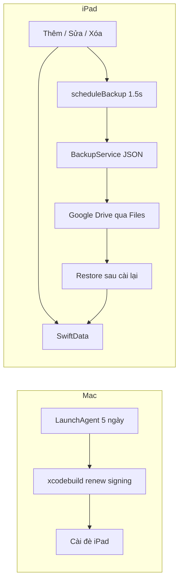

<!-- date: 2026-08-02 -->
<!-- source: chat:a581ff22/d1a42203/8d6fcc2d · deploy iPad thật + renew signing -->

---
name: iPad Build Run
overview: Build & Run iPad; renew signing tối ưu tốc độ (check hạn → skip, else resign+install đè, không clean); auto backup Google Drive mỗi thay đổi data.
todos:
  - id: xcode-signing
    content: Mở Xcodeproj, chọn iPad thật, Automatic Signing + Apple ID, ⌘R lần đầu + Trust
    status: cancelled
  - id: renew-script
    content: "renew-ipad-signing.sh nhanh: check hạn → skip; else refresh profile + codesign + install đè (không clean/rebuild nếu đã có .app)"
    status: completed
  - id: backup-service
    content: BackupService — JSON snapshot + bookmark folder; scheduleBackup() debounce ~1.5s; restore khi store trống
    status: completed
  - id: backup-hooks
    content: Gọi scheduleBackup sau mọi thay đổi SwiftData (save cue, import, wipe, soft-delete, lưu vocab, …)
    status: completed
  - id: backup-ui
    content: UI chọn thư mục (gợi ý Google Drive) / Backup ngay / Restore; backup thêm khi scene background
    status: completed
  - id: smoke-check
    content: Smoke assert parse/roundtrip JSON backup
    status: completed
isProject: false
---

# iPad Build & Run + auto renew signing + backup Google Drive (Files)

Status: **code done** (2026-08-07) — renew/backup/UI shipped; first-run Xcode signing is manual ops (`FIRST_RUN.md`), cancelled as agent todo.

## Thực tế kỹ thuật

1. **Chữ ký free ~7 ngày** — chỉ renew từ Mac (`xcodebuild`). Không xóa app khi hết hạn; Run đè là đủ.
2. **Xóa app = mất sandbox** — data phải nằm ngoài app.
3. **Google Drive trên iPad** — app không được ghi thẳng vào Drive như một API “có sẵn”. Cách đúng và ngắn: dùng **Files** (`UIDocumentPicker`). Google Drive (app đã cài + đăng nhập) hiện trong sidebar Files → user chọn folder Drive một lần → app ghi `caption-studio-backup.json` vào đó qua security-scoped URL. **Không** thêm Google Sign-In / Drive SDK.



## A. Cài lần đầu

1. iPad + Developer Mode; mở [`ipad-app/YouTubeJPCaptionStudio.xcodeproj`](ipad-app/YouTubeJPCaptionStudio.xcodeproj).
2. Automatic Signing + Team; Bundle ID cố định; ⌘R; Trust certificate.
3. Smoke Overlay / Side panel.

## B. Auto renew chữ ký — càng nhanh càng tốt

Mục tiêu: **không compile lại** nếu tránh được; chỉ refresh profile + resign + cài đè. Data sandbox giữ nguyên (install overwrite).

### Pipeline nhanh ([`ipad-app/scripts/renew-ipad-signing.sh`](ipad-app/scripts/renew-ipad-signing.sh))

1. **Check hạn trước** — đọc `ExpirationDate` từ profile đã embed trong `.app` (hoặc `~/Library/Developer/Xcode/UserData/Provisioning Profiles/*.mobileprovision`). Nếu còn **> 48 giờ** → exit 0 ngay (vài trăm ms). Không đụng Xcode.
2. **Cần renew** → xóa profile cached cũ của bundle (ép Xcode lấy profile mới), rồi:
   - **Fast path (ưu tiên):** đã có `.app` build sẵn (path cố định sau lần ⌘R / `BUILD_DIR`) → `xcodebuild … build -allowProvisioningUpdates` **chỉ khi** thiếu `.app`; nếu có `.app` thì dùng `codesign --force --sign "Apple Development" --timestamp=none` + entitlements từ app → `xcrun devicectl device install app` (hoặc `ios-deploy -b`) **cài đè**.
   - Thực tế Xcode automatic signing: lần renew thường vẫn cần một `xcodebuild build -allowProvisioningUpdates` **không `-clean`**, DerivedData nóng → incremental gần như chỉ re-sign/link nếu không đổi source. **Cấm** `clean` / xóa DerivedData trong script.
3. **Install đè** lên cùng Bundle ID — không xóa app trên iPad.
4. Log ngắn `~/Library/Logs/YouTubeJPCaptionStudio-renew.log` (skip / resign-ms / fail).

### Lịch

- LaunchAgent **mỗi ngày** (hoặc mỗi 12h): hầu hết lần chỉ check hạn rồi thoát.
- Renew thật khi còn ≤48h — tránh đợi đến lúc app đã chết rồi mới chạy (lúc đó user đang bị chặn).

### Prerequisite

- Mac + Xcode Accounts; iPad reachable (USB hoặc wireless debug đã pair).
- Comment đầu script: UDID, path `.app`, `launchctl load`.

### Không làm

- Không full archive/IPA pipeline.
- Không fastlane/match (nặng hơn nhu cầu 1 máy).
- Paid Developer ($99) vẫn là cách “nhanh nhất vĩnh viễn” (hết chu kỳ 7 ngày) — ghi chú, không bắt buộc lúc này.
## C. Auto backup → Google Drive (qua Files)

### Cách dùng (user)

1. Cài / mở **Google Drive** trên iPad, đăng nhập, hiện trong Files.
2. Trong app: **Chọn thư mục backup** → picker → **Google Drive** → folder (vd. `YouTube JP Caption Studio`).
3. Mỗi lần thêm / sửa / xóa data → app **tự ghi JSON** (debounce ~1.5s để gõ chữ không spam Drive). Nút **Backup ngay** + backup khi vào nền vẫn giữ làm lưới an toàn.
4. Xóa app → cài lại → chọn lại cùng folder → Restore (hoặc auto nếu store trống).

### Code

- [`ipad-app/Services/BackupService.swift`](ipad-app/Services/BackupService.swift):
  - `scheduleBackup(context:)` — hủy Task cũ, đợi ~1.5s, rồi ghi `caption-studio-backup.json` (toàn bộ scripts + cues + vocab).
  - `backupNow` / `restore` / lưu security-scoped bookmark.
- **Hook sau mọi mutation** (một chỗ gọi `scheduleBackup`, không rải logic backup): sau `modelContext.save()` / các path đổi data trong [`ContentView`](ipad-app/Views/ContentView.swift), cue edit, import/apply, wipe, soft-delete, lưu vocab ([`DictPopupView`](ipad-app/Views/DictPopupView.swift) / VocabStore). Grep `modelContext` / `context.insert` / `context.delete` / `.save(` để không sót.
- UI 3 nút: Chọn thư mục / Backup ngay / Restore. Copy: “Chọn folder trên Google Drive trong Files”.
- `scenePhase == .background` → `backupNow` nếu còn thay đổi chưa flush (hủy debounce, ghi ngay).
- Bookmark mất sau xóa app → chọn lại folder một lần.

### Schema JSON

```text
{ "version": 1,
  "scripts": [{ "videoId", "title", "owned", "cues": [{ id, startTime, duration, textJA, textEN, textVI, isDeleted }] }],
  "vocab": [{ "word", "reading", "meaning", "jlptLevel", "frequencyCount", "savedAt" }] }
```

### Lưu ý Google Drive File Provider

- Debounce bắt buộc: sửa từng ký tự cue không được ghi Drive mỗi lần.
- Cần mạng khi ghi; nếu fail → status ngắn, lần `scheduleBackup` / background / Backup ngay sau sẽ thử lại.
- Ưu tiên Google Drive (hoặc iCloud Drive); tránh folder chỉ nằm trong container app.
- Không Drive API / OAuth (YAGNI).

### Smoke

DEBUG assert: encode → decode → số cue/vocab khớp.

## D. Không làm

- Không CloudKit, không Google SDK.
- Không đổi Bundle ID giữa các lần build.

## Checklist

- [x] Signing + Run iPad (manual ops — `Scripts/FIRST_RUN.md`; not agent-automatable)
- [x] Renew script nhanh (check hạn → skip; else resign+install, không clean) + LaunchAgent hàng ngày
- [x] BackupService + debounce `scheduleBackup` sau mọi thêm/sửa/xóa
- [x] UI chọn folder Google Drive; xóa app → restore đủ
