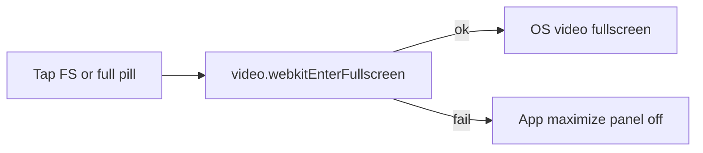

<!-- date: 2026-08-02 -->
<!-- source: chat:4721cf52 · user: Tổng hợp lại thành 1 plan, normalize -->

---
name: iPhone App Normalized
overview: "Baseline `iphone-app/` + bugfix: zoom phải vào OS video fullscreen (webkitEnterFullscreen); fallback app maximize nếu fail; panel off / overlay ok khi full."
todos:
  - id: os-fs-webkit
    content: FS button + full pill → video.webkitEnterFullscreen(); panel off; restore on webkitendfullscreen
    status: completed
  - id: fs-fallback
    content: If webkitEnterFullscreen throws/unsupported → keep app maximize path (no YT error tooltip)
    status: completed
  - id: docs-sync
    content: Update walkthrough §1.1b — OS video FS primary, app maximize fallback
    status: completed
  - id: smoke-fs
    content: "Light Sim: full pill / YT FS → native FS or app-full; no unsupported tooltip; panel off"
    status: completed
isProject: false
---

# iPhone app — plan chuẩn hóa + bug fullscreen

Gộp baseline đã ship. **Bug hiện tại:** nhấn zoom/full không mở **OS fullscreen** (chỉ app maximize hoặc YT báo không hỗ trợ). User muốn **bật full OS**.

## Bug / nguyên nhân

- Element Fullscreen API (`requestFullscreen`) trong WKWebView → YouTube hiện *"Trình duyệt không hỗ trợ toàn màn hình."*
- Plan trước chuyển sang **app maximize** (cố ý) → không phải OS FS → user báo bug.

**Hướng chốt:** ưu tiên **iOS native video fullscreen** qua `HTMLVideoElement.webkitEnterFullscreen()` (API iOS, khác Element FS). App maximize chỉ còn **fallback**. Khi full (OS hoặc app): **tắt panel**, **chỉ overlay**.

## Baseline sản phẩm (đã có — giữ)

| | |
|---|---|
| Path | [`iphone-app/`](iphone-app/) |
| Bundle | `com.example.YouTubeJPCaptionStudio.iPhone` |
| Layout | Portrait stacked + topBar; landscape ẩn topBar + split; soft widen CSS an toàn |
| Pills | **overlay → panel → timeline → full** |
| Panel | Cue timestamp + JA + VI + ĐANG PHÁT only |
| Menu | Connect Drive only |
| YT CSS | Ẩn masthead + title/owner; cấm `#secondary`/`#related`/`overflow:hidden`/fixed |
| Player | Watch URL + `playsinline=1` + desktop UA |

## Fix fullscreen (việc chính khi Build)

### JS — [`user_script.js`](iphone-app/Scripts/user_script.js)

Trên capture click `.ytp-fullscreen-button` (và khi Swift pill full gọi `evaluateJavaScript`):

1. `preventDefault` / `stopPropagation` (chặn tooltip YT).
2. `var v = mainVideo()`; nếu `v.webkitEnterFullscreen` → gọi nó.
3. Nếu throw / không có API → fallback `__csAppFull` + `fullscreenHandler { active }` như hiện tại.
4. Listen `webkitbeginfullscreen` / `webkitendfullscreen` → post `{ active, mode: "os"|"app" }`.

### Swift

- [`YouTubePlayerView`](iphone-app/Views/YouTubePlayerView.swift): giữ `isElementFullscreenEnabled`; method/`evaluateJavaScript` để pill full gọi cùng logic JS (`window.__csToggleFull()`).
- [`ContentView`](iphone-app/Views/ContentView.swift): `applyPlayerFullscreen` — panel off + overlay ok cho **cả** OS FS và app-full; restore khi `active: false`.
- Pill full gọi `__csToggleFull()` thay vì chỉ flip state local (để thử OS trước).

### Không làm

- Không phụ thuộc Element `requestFullscreen` (YT đã reject).
- Không fixed CSS / hide `#secondary` để “giả” full.
- Không sửa `ipad-app`.

## Smoke (sau fix)

| ID | Check |
|----|--------|
| F0 | YT FS / full pill: **không** tooltip "không hỗ trợ toàn màn hình" |
| F1 | Ưu tiên: vào OS video fullscreen (native controls) |
| F2 | Fallback: app maximize (panel off, topBar ẩn, overlay ok) |
| F3 | Thoát FS / pill: panel restore |

Evidence: `.tmp-iphone-verify/normalized/` nếu chạy smoke.

## Docs

Walkthrough §1.1b: full = thử `webkitEnterFullscreen` trước; fallback app maximize; panel off / overlay ok.
