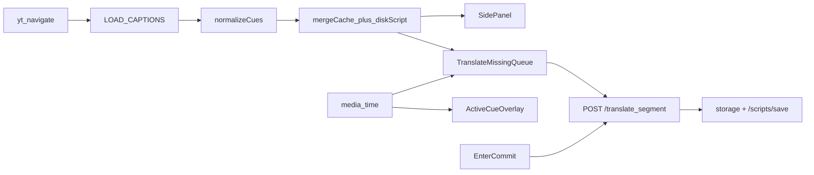

<!-- date: 2026-07-28 -->
<!-- source: chat:a29f50a8 (Translate) · user: Tổng hợp lại toàn bộ plan đã có thành 1 plan -->

---
name: Master Caption Translate
overview: "Gộp 7 plan của project YouTube Caption Translate thành một master plan: kiến trúc hiện tại (caption-only), quyết định đã chốt đã làm xong, và backlog còn lại — loại trừ plan project khác."
todos:
  - id: skills-meta
    content: Tạo create-project-skill + rule auto-create-skills.mdc (không seed architecture trùng)
    status: cancelled
  - id: learn-log
    content: Ghi edits.jsonl trong /scripts/save khi user sửa cue (Wave 4 cũ)
    status: cancelled
  - id: undo-delete
    content: "Nice-to-have: undo xóa cue"
    status: cancelled
  - id: dict-leave-polish
    content: "Nice-to-have: mouseleave JA chỉ hide nếu không vào token khác"
    status: cancelled
isProject: false
---

# Master plan: YouTube Caption Translate

Status: **core done; backlog cancelled** (2026-08-07) — remaining todos were nice-to-have / YAGNI; skills catalog now lives in root `AGENTS.md` + `skills/` (flatten), not create-project-skill ceremony.

Nguồn gộp (chỉ project này): `youtube_ocr_translate` → `ux_mt_pause_fixes` → `yt_caption_only` → `vocab_level_feature` → `auto_dịch_sau_edit` → `import_timeline_+_dict_hover` + phần còn lại của `project_skills_setup`. **Không gồm** GPT Live / Flappy / Unity.

Skill hiện tại là nguồn sự thật vận hành: [`.cursor/skills/youtube-hardsub-ocr/SKILL.md`](.cursor/skills/youtube-hardsub-ocr/SKILL.md).

---

## 1. Sản phẩm (chốt)

Chrome extension kiểu Language Reactor + local bridge `127.0.0.1:8765`:

- **Nguồn chữ chính:** YouTube timedtext (không OCR trong vòng lặp extension).
- **Dịch local:** NLLB-200 CT2 JA→EN ∥ JA→VI; Opus pivot chỉ fallback.
- **UI:** overlay trên video + Chrome Side Panel (furigana, dict VI·EN, vocab/JLPT highlight, import/export, edit Enter-only).
- **Máy đích:** M5 Pro 24GB; governor caps; SLA dịch cue ≤1s khi model warm.

**Lịch sử pivot:** MVP ban đầu OCR hardsub (`/ocr_translate`) đã build; `yt_caption_only` chuyển sang caption. OCR còn trên bridge nhưng **không** dùng bởi extension.

---

## 2. Đã hoàn thành (gộp theo lớp)

### A. Nền tảng (OCR-era → vẫn giữ một phần)

- Bridge FastAPI: `/health`, `/bootstrap`, governor, Sudachi, JMdict, dict longest-match.
- Extension MV3: page-world capture, storage theo `videoId`, export TXT, overlay/panel resize-drag.
- 3 project skills: `youtube-hardsub-ocr`, `hardsub-ocr-regression` (MT/glossary), `local-bridge-dev`.

### B. Caption-only pipeline

- `LOAD_CAPTIONS` full cues; normalize SFX; **giữ** start/end YouTube (không shift fragment trên load).
- Cache `transcript:${videoId}` + disk `scripts/{videoId}/`; merge ±0.35s + source; queue chỉ cue thiếu, lookahead ~45s.
- `POST /translate` + `POST /translate_segment` (context window); không hydrate dump một cục.

### C. Ownership + edit UX

- Script đã sửa thắng YT merge; tombstone cue xóa; add/delete theo cue **id**.
- Enter-only commit (blur/Escape hủy): JA → MT; EN/VI → lock user, không reverse-MT.
- `autoOpen`; pill mở panel + ensure overlay ON; opacity/show JA|EN|VI; `barScale`.
- Translation lock (`mt_locked` / `user`|`import`|`mt`); ↻ unlock + force; Xóa dịch.

### D. MT chất lượng

- Colloquial `expand_to` an toàn (neo, không đụng `cue.source`); glossary mask slang/proper; cache mtime+hash; `HARDUB_COLLOQUIAL_EXPAND`.
- Suspects → `suspects.jsonl`; regression tests MT/glossary.

### E. Vocab / dict UX

- `freq_rank` / JLPT trên token; highlight side panel + overlay; level colors drawer; `userVocab` categories.
- Dict popup VI·EN; highlight `tok-dict-active`; `updateBar` skip rebuild cùng fingerprint (hết chớp dict).

### F. Import / timeline

- Parse head `0:00 - 0:02` / `→` / `–` / `—`; `end<=start` → tạm +2 rồi clamp next; export `start → end`.

---

## 3. Backlog còn lại (ưu tiên)

Các mục dưới đây là việc **chưa làm / hoãn** từ các plan cũ — đây là phần “còn phải làm” của master plan.

1. **Skills meta (từ `project_skills_setup`, vẫn pending)**  
   - Tạo [`.cursor/skills/create-project-skill/SKILL.md`](.cursor/skills/create-project-skill/SKILL.md)  
   - Rule alwaysApply [`.cursor/rules/auto-create-skills.mdc`](.cursor/rules/auto-create-skills.mdc)  
   - Không seed lại `hardsub-ocr-architecture` trùng skill caption hiện có — chỉ meta + rule.

2. **Learn log tối giản (Wave 4 optional cũ)**  
   - Ghi `edits.jsonl` trong `/scripts/save` khi user sửa JA/timeline/EN/VI — không endpoint/skill riêng.

3. **Nice-to-have UX**  
   - Undo xóa cue.  
   - Dict hide: khi `mouseleave` JA line chỉ schedule hide nếu không vào token khác.

4. **Ngoài phạm vi (giữ out-of-scope)**  
   - Cloud sync / multi-device / Anki.  
   - Đánh giá cấp độ EN; Netflix-style proprietary freq.  
   - Xóa sạch code OCR trên bridge; engine OCR thứ hai; launchd agent.  
   - Whisper fallback; skill `script-timeline-learn` riêng.

---

## 4. File neo chính

| Vai trò | Path |
|---|---|
| Engine + overlay | [`extension/content/content.js`](extension/content/content.js) |
| Normalize | [`extension/content/normalize_cues.js`](extension/content/normalize_cues.js) |
| Side panel | [`extension/sidepanel/`](extension/sidepanel/) |
| Bridge API | [`local-bridge/main.py`](local-bridge/main.py) |
| MT / glossary | [`local-bridge/translate.py`](local-bridge/translate.py), [`local-bridge/glossary.py`](local-bridge/glossary.py) |
| Script disk | [`local-bridge/script_store.py`](local-bridge/script_store.py) |
| Agent truth | [`.cursor/skills/youtube-hardsub-ocr/SKILL.md`](.cursor/skills/youtube-hardsub-ocr/SKILL.md) |

---

## 5. Cách dùng master này

- Implement tiếp → chỉ lấy **§3 Backlog**, bắt đầu từ skills meta hoặc learn log tùy nhu cầu.  
- Không mở lại plan OCR-first trừ khi chủ đích khôi phục hardsub path.  
- Mọi quyết định vận hành mới → cập nhật skill `youtube-hardsub-ocr`, không tạo plan song song trùng nội dung.
