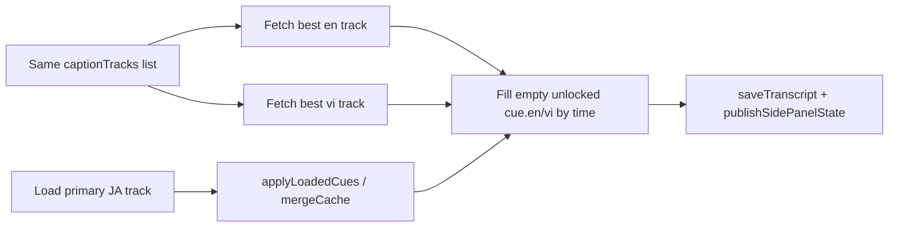

<!-- date: 2026-08-02 -->
<!-- source: chat:e011231b · overlay + multi-sub (plan trước khi sửa) -->

---
name: Overlay + multi-sub
overview: Decouple overlay toggle from side-panel close, then when a video has JA/EN/VI YouTube tracks, fill cue.en/cue.vi from those tracks, save to disk, and push to the side panel.
todos:
  - id: decouple-overlay
    content: Remove closeSidePanel from setShowOnVideo(false); update Overlay/DỊCH titles
    status: completed
  - id: sw-secondary-tracks
    content: Extend YT_LOAD_CAPTIONS to also fetch best en/vi tracks when present
    status: completed
  - id: merge-en-vi
    content: Fill empty unlocked cue.en/vi by time after applyLoadedCues; cover intercept early paths
    status: completed
  - id: docs-check
    content: walkthrough/README + skill note; one time-align sanity check
    status: completed
isProject: false
---

# Fix overlay closing panel + pull YT EN/VI subs

## 1. Bug: Overlay tắt luôn cả panel

**Root cause (intentional coupling, not event bubbling):** [`setShowOnVideo`](youtube-jp-caption-studio/extension/content/content.js) always opens the panel on ON and closes it on OFF. Both the player DỊCH pill and `#sp-overlay` call `toggleShowOnVideo()` → same path.

```2015:2027:youtube-jp-caption-studio/extension/content/content.js
  async function setShowOnVideo(on, ...) {
    // ...
    applyBarVisibility();
    if (next) {
      await openSidePanel();
    } else {
      await closeSidePanel();  // ← closes panel when overlay OFF
    }
```

**Fix (default UX):** Overlay only controls on-video bar visibility.
- ON → still `openSidePanel()` (useful when turning DỊCH on from the player).
- OFF → **do not** call `closeSidePanel()`; leave the panel open.
- Update button titles/copy that currently say “overlay + side panel” in [`sidepanel.html`](youtube-jp-caption-studio/extension/sidepanel/sidepanel.html) and the player toggle title in `content.js`.

Choke point is one function; both entry points are fixed together.

## 2. Feature: Nếu có sub JA / EN / VI trên YT → ghi file + đẩy side panel

Today the cascade loads **one** track into `cue.source` (prefer JA). EN/VI only come from Import / manual edit — YouTube EN/VI tracks are never fetched. Cue shape and save/side-panel already support `en`/`vi`.



**Approach (minimal):**

1. **Extend SW** [`handleYtLoadCaptions`](youtube-jp-caption-studio/extension/background/service_worker.js): after the primary timedtext succeeds, from the same `captionTracks` list pick best `en*` and `vi*` (manual preferred over ASR, same `scoreTrack` idea), fetch in parallel, return `{ cues, lang, enCues?, viCues? }`. Skip a secondary if it is the same URL/lang as primary.

2. **Content merge** in [`content.js`](youtube-jp-caption-studio/extension/content/content.js): after `mergeCache` in `applyLoadedCues` (or a small helper called from every success path), align secondary cues onto the JA timeline by `start` ± `CACHE_MATCH_TOL` (0.35s). Fill only empty **unlocked** `en`/`vi` (respect `mt_locked` / import / user). Set `translation_source: "yt"` when filled from YouTube (not MT).

3. **Page-intercept early returns** currently apply primary only then `return`. After those applies, kick a non-blocking secondary enrich (`YT_LOAD_CAPTIONS` with primary already applied, or a thin `alsoSecondary` path) so intercept-fast path still gets EN/VI.

4. Existing `scheduleSaveTranscript` / `publishSidePanelState` already persist and push `en`/`vi` — no schema or side-panel UI change.

5. **Owned/import scripts:** do not overwrite locked EN/VI; only fill blanks. Matches current ownership rules.

6. **Docs:** this is a user-facing capability — update [`walkthrough.md`](youtube-jp-caption-studio/walkthrough.md) + short README blurb; adjust the skill line that says EN/VI only from Import (now also YT tracks when present). Append nothing to `errors.log` unless something fails at runtime.

7. **One sanity check:** tiny assert-style script (or extend an existing normalize sanity) for “align EN/VI by time, skip locked” — ponytail one runnable check.

## Out of scope

- Machine translation / auto-generate missing EN/VI.
- Changing `sourceLang` UI or making VI the primary timeline.
- Separate close-panel control (user closes panel via Chrome UI as today).
