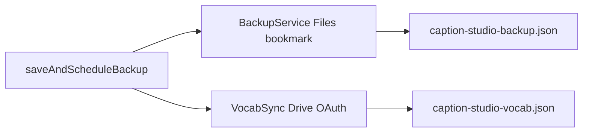

<!-- date: 2026-08-04 -->
<!-- source: chat:e16f1198 · user: viết plan cho tôi -->

---
name: P0 data-loss fixes
overview: Fix the five verified P0 issues from the DeepSeek review (vocab silent fail, backup Lamport wipe, VocabSync file clobber, cue ID collision, project.yml drift) on both iPad and iPhone apps with the smallest working diffs.
todos:
  - id: vocab-upsert
    content: Vocabulary upsert helper + wire DictPopupView/CueEditorRow (iPad+iPhone) + smoke
    status: done
  - id: script-dto-rev
    content: Add optional rev/deviceId to ScriptDTO encode/apply + smoke (iPad+iPhone)
    status: done
  - id: vocab-split-file
    content: VocabSync fileName → caption-studio-vocab.json (iPad+iPhone)
    status: done
  - id: cue-uuid
    content: UUID suffix on addCueAtPlayhead / addCue(after:) (iPad+iPhone)
    status: done
  - id: project-yml
    content: LSSupportsOpeningDocumentsInPlace in project.yml; bundle only user_script.js; xcodegen
    status: done
isProject: false
---

# P0 data-loss fixes — DeepSeek handoff (iPad only)

**Assignee:** Copilot / DeepSeek V4 Flash  
**Scope:** [`ipad-app/`](ipad-app/) only. Do **not** edit `iphone-app/`.  
**Do:** review items **#1–#5** only.  
**Do not:** #6–#24, refactors, new abstractions, DriveScripts LWW changes.

Constraints: shortest working diff; reuse existing smoke tests; no new dependencies.

---

## 1. Vocab upsert (#1)

Files: [`Models/VocabStore.swift`](ipad-app/Models/VocabStore.swift), [`Views/DictPopupView.swift`](ipad-app/Views/DictPopupView.swift), [`Views/CueEditorRow.swift`](ipad-app/Views/CueEditorRow.swift)

- Add one helper (e.g. `Vocabulary.upsert(...)`) that fetches by `word`; if found updates reading/meaning + `frequencyCount += 1` + `savedAt`; else inserts.
- Replace blind `insert(Vocabulary(...))` in DictPopupView + CueEditorRow.
- DEBUG smoke: save same word twice → 1 row, `frequencyCount == 2`.

## 2. ScriptDTO Lamport fields (#2)

File: [`Services/BackupService.swift`](ipad-app/Services/BackupService.swift)

- Add optional `rev: Int?`, `deviceId: String?` to `ScriptDTO`.
- Encode from `VideoScript`; apply with `?? 0` / `?? ""`.
- Smoke: round-trip preserves non-zero rev.

## 3. Split VocabSync file (#3)

File: [`Services/VocabSync.swift`](ipad-app/Services/VocabSync.swift)

- Change `fileName` to `"caption-studio-vocab.json"` (do not share `BackupService.fileName`).
- No LWW merge; no migration from old backup file.
- Update smoke comments if they name the old file.

## 4. Cue ID (#4)

File: [`Models/ScriptStore.swift`](ipad-app/Models/ScriptStore.swift)

- In `addCueAtPlayhead` and `addCue(after:)`: replace `% 100_000` with UUID suffix, e.g. `"\(Int(start))-\(UUID().uuidString.prefix(8))-user"`.

## 5. project.yml (#5)

Files: [`project.yml`](ipad-app/project.yml), then regenerate `.xcodeproj`

- Add `LSSupportsOpeningDocumentsInPlace: true` under `info.properties`.
- Bundle only `Scripts/user_script.js` (not COMMANDS.md / deploy / renew).
- Run `xcodegen generate` in `ipad-app/`.

---

## Out of scope

- Entire `iphone-app/` (same bugs exist; fix later if needed)
- Review #6–#24
- Changing `DriveScriptsService` pull / JA-only LWW (#8)
