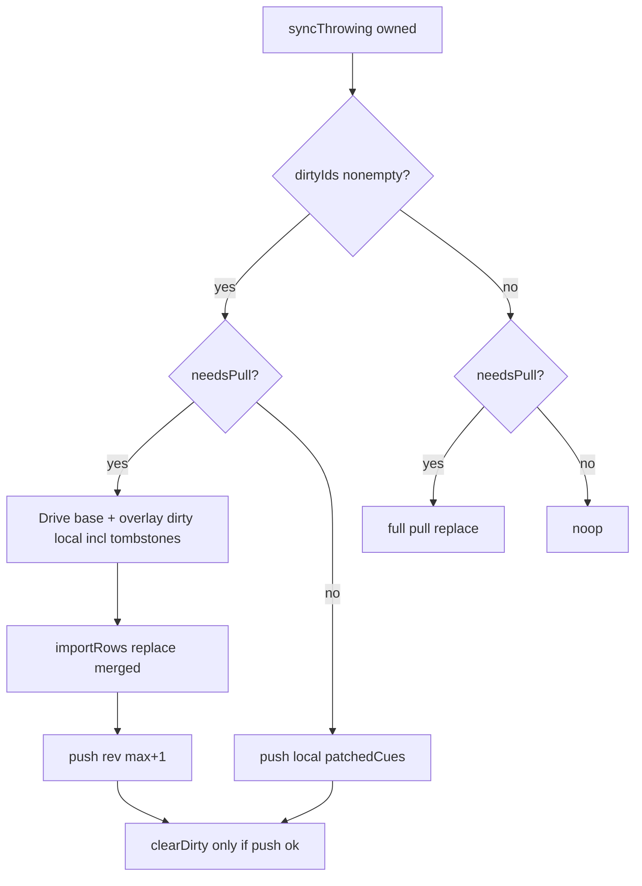

<!-- date: 2026-08-05 -->
<!-- source: chat:a9831745-889f-4dcf-9989-47a1d5928a55 · user: Tạo plan / check lại / đổi tên theo format -->

---
name: P0 data-loss fixes
overview: Sửa lỗ P0 data-loss — Drive sync merge theo cue (kèm soft-delete/tombstone), Backup single-save, Extension rev guard. Không đụng Docker/bridge.
todos:
  - id: drive-cue-merge
    content: "DriveScriptsService: dirty per-cue + merge khi dirty+pull; pull-only không push; softDelete dirty; smoke; iPad+iPhone"
    status: done
  - id: backup-single-save
    content: "BackupService.apply: bỏ save giữa wipe và insert (iPad+iPhone identical)"
    status: done
  - id: ext-drive-restored-guard
    content: "content.js DRIVE_RESTORED: skip apply khi memory rev >= disk/Drive"
    status: done
isProject: false
---

# P0 data-loss fixes — cue-merge (đa nền tảng)

Ưu tiên #1: **edit local không bị Drive/restore ghi đè**. Scope: Drive cue-merge + Backup + Extension rev guard. Không Docker/bridge.

**Sync:** merge theo **cue**. A sửa cue1, B sửa cue2 → giữ cả hai. Cùng cue id → local dirty thắng (LWW cue).

Khác [`plan/p0-data-loss-fixes-2026-08-04.md`](p0-data-loss-fixes-2026-08-04.md) (DeepSeek: vocab/rev DTO — đã done). Plan này là P0 tiếp theo từ review Fable 5.

## Review chất lượng (đã chỉnh)

Đủ tốt để làm **sau các sửa dưới**. Bản trước có 3 lỗ nghiêm trọng:

1. Flowchart cũ luôn merge→push kể cả khi **chỉ pull, không dirty** → thừa bump rev / ping-pong. Đã tách nhánh.
2. Thiếu **softDelete / tombstone** trong dirty + merge → cue đã xóa local có thể bị Drive hồi sinh.
3. `clearDirty` phải **sau push thành công**; push fail mà clear → lần sau bị pull đè.

Gap chấp nhận (ghi rõ, không làm đợt này):

- Extension chỉ rev-skip, **chưa** cue-merge → edit trên Chrome vẫn có thể bị `DRIVE_RESTORED` nếu rev chưa bump.
- `try? context.save()` sau push vẫn nuốt lỗi (High review cũ) — ngoài scope.
- Hai máy sửa **cùng cue id** → LWW cue (không merge chữ trong câu).

## 1. Drive sync — merge theo cue

Files: [`ipad-app/Services/DriveScriptsService.swift`](../ipad-app/Services/DriveScriptsService.swift) + cùng diff [`iphone-app/Services/DriveScriptsService.swift`](../iphone-app/Services/DriveScriptsService.swift). Wire `markDirty` từ [`ipad-app/Models/ScriptStore.swift`](../ipad-app/Models/ScriptStore.swift) (+ iPhone identical) và chỗ edit UI nếu cần.

**Bảng thắng:**

| Cue | Thắng |
|---|---|
| id trong dirty (sửa / xóa dịch / softDelete / add / import) | Local (kể cả `isDeleted`) |
| không dirty, có trên Drive | Drive |
| local-only + dirty | Local |
| Drive-only, không dirty | Drive |

**Dirty (UserDefaults, không SwiftData):**

- Key `drive-dirty-cues-{videoId}` → `[String]` ids.
- `markDirty(videoId, cueIds:)`, `dirtyIds`, `clearDirty`.
- Gọi `markDirty` tại:
  - `clearTranslations` — mọi live id
  - `softDelete` — id bị xóa (**bắt buộc**)
  - `addCueAtPlayhead` / `addCue(after:)` — id mới
  - `importRows` replace — mọi id sau import
  - Sửa text/timing: `CueEditorRow` scheduleSave / `applyTimeline` — id cue đó (iPad; iPhone display-only thì path ít hơn)

**`syncThrowing` khi owned (sau khi đã fetch Drive):**

| dirty? | needsPull? | Hành vi |
|---|---|---|
| Có | Có | Merge (Drive nền + overlay dirty local, gồm tombstone) → apply → **push** → clearDirty nếu put ok |
| Có | Không | Push local (`patchedCues` hiện có) → clearDirty nếu put ok |
| Không | Có | **Full pull replace** như cũ — **không** push, không bump rev |
| Không | Không | Noop |

- Unowned / empty local: full pull như cũ (không merge).
- `needsPull`: **bỏ** nhánh `localOwned && localTranslated==0 && driveTranslated>0`.
- Push fail: **giữ** dirty; không clear.

**Smoke (`DriveScriptsSmoke`):**

- Dirty cue B + Drive cue A khác id → merge còn cả hai; push rev tăng.
- Clear-MT dirty → không bị MT Drive đè.
- softDelete dirty → cue không bị Drive hồi sinh.
- needsPull, không dirty → full pull, **không** tăng rev local giả.
- Bỏ assert rule 0-MT cũ.

## 2. Backup restore — một lần save

[`ipad-app/Services/BackupService.swift`](../ipad-app/Services/BackupService.swift) (identical iPhone): xóa `try context.save()` giữa wipe và insert (~283). Một save cuối.

## 3. Extension `DRIVE_RESTORED` — rev guard tối thiểu

[`youtube-jp-caption-studio/extension/content/content.js`](../youtube-jp-caption-studio/extension/content/content.js) (~587–610):

- Memory `transcriptMeta.rev` ≥ disk/Drive rev + đang owned cues → skip remove+apply.
- Drive newer → apply như cũ.
- **Ceiling:** chưa cue-merge trên extension; edit Chrome chưa bump rev vẫn rủi ro.

## 4. Kiểm tra

- Smoke trên.
- Manual: iPad dirty cue1, máy khác push cue2 → sync iPad → cả hai; softDelete không hồi sinh.
- Restore backup: fail giữa chừng không wipe vĩnh viễn.

## Không làm

- Docker / bridge
- Cue-merge trên Chrome extension
- iPhone fullscreen pinning (P1)
- postMessage / OAuth state / ATS / Dictionary crash (P1)
- Sửa `try? context.save()` nuốt lỗi
