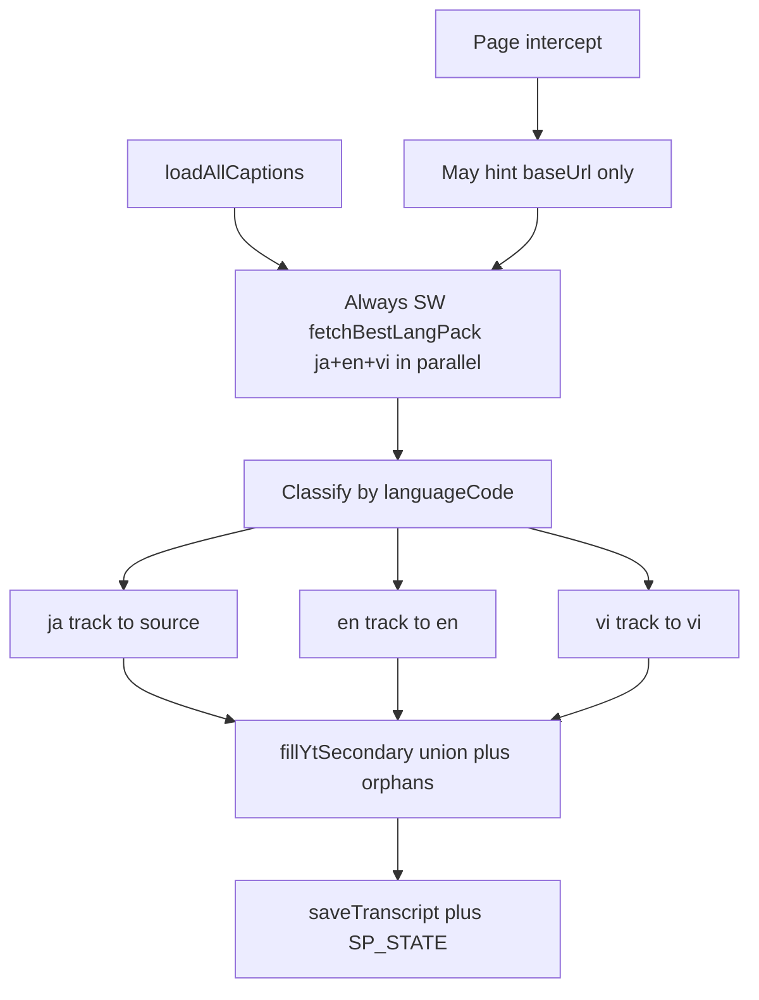

<!-- date: 2026-08-02 -->
<!-- source: chat:e011231b · timeline + YT multi-sub -->

---
name: Timeline + YT multi-sub
overview: "Hai việc từ video 21:57: (1) side-panel follow-scroll timeline parity với iPad; (2) sửa lấy phụ đề — video có JA/EN/VI trên YT nhưng panel để trống VI/EN và chỉ bắt 1 track intercept."
todos:
  - id: timeline-scroll
    content: "sidepanel scrollActiveIntoView: 24px threshold + coalesce; ĐANG PHÁT label"
    status: completed
  - id: active-gap-hold
    content: findActiveCue gap-hold + last-cue grace like iPad
    status: completed
  - id: yt-multilang-fix
    content: Force JA/EN/VI classify by track lang; await/apply enrich on intercept; status + errors.log on silent fail
    status: completed
  - id: verify
    content: Verify on Yuka-like video + sanity script
    status: completed
isProject: false
---

# Side-panel timeline như iPad + sửa lấy phụ đề YT

Bằng chứng từ [recording](file:///Users/hoangson/Desktop/Ghi%20Màn%20hình%202026-08-02%20lúc%2021.57.25.mov): video Yuka có CC **Tiếng Việt** + **English** trên YouTube; side panel hiện `ja intercept · 474 cues · cached 0/474 · pending 474` với **VI/EN trống**. Follow timeline chưa pin cue đang phát sát đỉnh list như iPad.

## A. Timeline scroll = iPad

Tham chiếu iPad [`ContentView.scrollActiveIntoView`](ipad-app/Views/ContentView.swift) + [`ScriptCue.active`](ipad-app/Models/ScriptStore.swift) + [`CueEditorRow` ĐANG PHÁT](ipad-app/Views/CueEditorRow.swift).

Sửa extension:

| Gap | Đổi |
|---|---|
| Skip threshold 12% height | → **~24px** trong [`sidepanel.js`](youtube-jp-caption-studio/extension/sidepanel/sidepanel.js) `scrollActiveIntoView` |
| Không coalesce short cues | Thêm `scrollAnimInFlight` + `pendingScrollId` (như iPad) |
| Active `[start,end)` cứng | [`findActiveCue`](youtube-jp-caption-studio/extension/content/content.js): **giữ cue qua gap** tới start cue sau; last cue +150ms grace |
| Không nhãn đang phát | Thêm label reserved **ĐANG PHÁT** trên row active (CSS + markup trong render list) |

Không đổi UX nút “Theo timeline” (ẩn khi đang follow) — chỉ parity pin/scroll/active.

## B. Lấy phụ đề: JA→source, EN→en, VI→vi (đúng yêu cầu)

**Sai hiện tại (đúng với video):** path `ja intercept` early-return 1 track vào `source`; `enrichYtSecondaryFromSw` fire-and-forget — nếu SW không trả `enCues`/`viCues` hoặc `n===0` thì **im lặng**, VI/EN trống mãi. Intercept còn có thể bắt đúng body của CC đang bật (VI) rồi gắn nhầm vào “JA”.

**Cách làm (chọn cứng):**

1. **Không tin intercept làm nguồn ngôn ngữ.** Intercept chỉ dùng để tăng tốc / `baseUrl` hint. Timeline `source` **chỉ** từ track `ja*`; `en`/`vi` từ track `en*`/`vi*` (manual > ASR). Nếu không có JA mà có EN/VI → vẫn ghi đúng cột (source có thể trống), không nhét VI vào `source`.

2. **Choke point:** sau mọi success path (intercept / SW / page LOAD), bắt buộc chạy union từ **cùng** `enCues`/`viCues` SW (đồng bộ khi có sẵn; nếu intercept thắng sớm thì vẫn `await enrichYtSecondaryFromSw` trước khi coi load xong — hoặc SW parallel đã start từ đầu như hiện tại nhưng **phải apply + publish** khi xong, kể cả toast nhẹ nếu thiếu track).

3. **Debug silent fail:** nếu track list có `en`/`vi` mà fill = 0 → log `errors.log` + status line (`en:0 vi:0` / `en:N vi:M`) để thấy trên panel.

4. **Owned script:** vẫn không đè EN/VI đã lock; vẫn fill **ô trống**; orphans chỉ khi chưa owned (giữ ownership). Video recording là fresh (`cached 0/474`) — fix path này là đủ cho case user quay.

5. Smoke: video có 3 CC → Reload → mỗi cue (hoặc gần khớp ±0.35s) có text đúng cột; `script.txt` luôn `JA:`/`EN:`/`VI:`; orphan lệch timing vẫn thêm row.

## Files chính

- [`extension/sidepanel/sidepanel.js`](youtube-jp-caption-studio/extension/sidepanel/sidepanel.js) + CSS/HTML — scroll + ĐANG PHÁT
- [`extension/content/content.js`](youtube-jp-caption-studio/extension/content/content.js) — `findActiveCue` gap-hold; load/enrich multi-lang bắt buộc
- [`extension/background/service_worker.js`](youtube-jp-caption-studio/extension/background/service_worker.js) — đảm bảo `fetchBestLangPack` luôn trả đủ lang có trên `captionTracks`
- [`extension/content/fill_yt_secondary.js`](youtube-jp-caption-studio/extension/content/fill_yt_secondary.js) — chỉ nếu cần chỉnh classify/empty-source rows

## Verify

1. Reload extension → mở video recording (Yuka / có JA+EN+VI) → Reload → VI/EN có chữ, không còn trống hàng loạt; status không kẹt `pending` vô hạn sau tokenize.
2. Bật Theo timeline → cue đang phát **dính đỉnh** list (±24px), gap không làm mất highlight, thấy **ĐANG PHÁT**.
3. `node scripts/fill_yt_secondary_sanity.js` vẫn pass.
