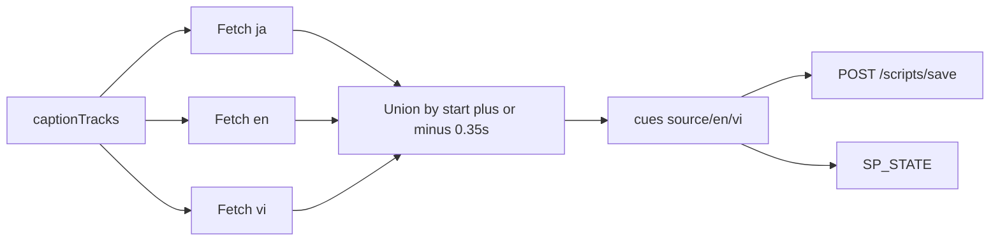

<!-- date: 2026-08-02 -->
<!-- source: chat:e011231b · user corrected multi-sub plan -->

---
name: YT write all subs
overview: "Khi YouTube có track JA/EN/VI: tải hết, union-merge vào source/en/vi, ghi file; script.txt luôn in đủ 3 dòng JA/EN/VI (không ẩn khi trống)."
todos:
  - id: sw-fetch-three
    content: "SW: fetch best ja/en/vi tracks when present; return all three cue lists"
    status: completed
  - id: union-merge
    content: Replace paint-only fill with union merge (align + append orphans) into source/en/vi
    status: completed
  - id: script-txt-always-show
    content: "script.txt render: always emit JA:/EN:/VI: lines even when empty (no hide)"
    status: completed
  - id: wire-save-panel
    content: Wire merge into load paths; saveTranscript + SP_STATE; respect locks
    status: completed
  - id: sanity-docs
    content: "Sanity: all-3 + orphan + empty lines visible; update walkthrough/README/skill"
    status: completed
isProject: false
---

# Load JA/EN/VI từ YouTube → ghi hết vào file (format hiện tại)

## Khi video có đủ 3 sub — làm gì

1. Lấy `captionTracks` → chọn **một** track tốt nhất mỗi ngôn ngữ: `ja*`, `en*`, `vi*` (manual ưu tiên hơn ASR).
2. Fetch **song song** 3 timedtext.
3. Gộp thành **một danh sách cue** đúng format đang dùng (mỗi dòng = 1 object):

```json
{
  "id": "...",
  "start_media_time": 12.3,
  "end_media_time": 15.0,
  "source": "日本語…",
  "en": "English…",
  "vi": "Tiếng Việt…",
  "translated": true,
  "text_source": "yt",
  "translation_source": "yt"
}
```

4. Cách gộp thời gian (**union**, không bỏ orphan):
   - Bắt đầu từ timeline JA → mỗi cue JA thành 1 row, `source` = text JA.
   - Với mỗi cue EN/VI: nếu có row trong ±0.35s thì ghi vào `en` / `vi`; **không khớp thì thêm row mới** (cột kia / `source` có thể trống).
   - Cùng cửa sổ thời gian: 3 ngôn ngữ nằm trên **cùng một row**.
5. `mergeCache` với script đã lưu: **không đè** `mt_locked` / import / user; chỉ điền chỗ trống hoặc tạo file mới.
6. `saveTranscript` → `cues.json` + chrome.storage; `publishSidePanelState` → side panel hiện JA/EN/VI.



## `script.txt`: luôn hiện đủ 3 dòng (không ẩn)

Hiện [`script_store.py`](youtube-jp-caption-studio/local-bridge/app/services/script_store.py) chỉ in `EN:` / `VI:` khi có text (`if en:` / `if vi:`), và `JA:` khi có `source`. **Đổi:** mỗi cue luôn ghi:

```text
[001] 0:00 → 0:13
JA: 私は毒島すみれ、図書委員です。
EN: I am Sumire Busujima, a library committee member.
VI:
# ----------------------------------------
```

(chỉ có JA+EN) hoặc orphan EN:

```text
[003] 0:20 → 0:24
JA:
EN: (extra English line with no Japanese match)
VI:
# ----------------------------------------
```

Furigana `(…)` chỉ thêm khi có tokens (như cũ). Import parse phải chấp nhận dòng `JA:` / `EN:` / `VI:` trống.

## Sửa so với plan / code cũ

- EN/VI không còn chỉ “sơn” lên cue JA rồi bỏ orphan — **ghi hết**, orphan thành cue mới.
- `script.txt` không còn ẩn cột trống — **luôn JA/EN/VI**.

## Chạm code

- [`extension/background/service_worker.js`](youtube-jp-caption-studio/extension/background/service_worker.js) — trả về đủ `ja`/`en`/`vi` cue lists khi track có.
- [`extension/content/fill_yt_secondary.js`](youtube-jp-caption-studio/extension/content/fill_yt_secondary.js) — **union merge** (fill + append orphans).
- [`extension/content/content.js`](youtube-jp-caption-studio/extension/content/content.js) — wire load → merge → save + publish.
- [`local-bridge/app/services/script_store.py`](youtube-jp-caption-studio/local-bridge/app/services/script_store.py) — luôn `lines.append("JA: …")` / `EN:` / `VI:` (kể cả rỗng).
- Import parse + test render nếu có assert “ẩn dòng trống”.
- Sanity + walkthrough/README/skill.

## Giữ nguyên

- Schema `cues.json` — một row `source`/`en`/`vi`; không file riêng theo ngôn ngữ.
- Overlay OFF không đóng panel (đã làm).
- Không MT; thiếu track → field/`script.txt` dòng đó để trống nhưng vẫn hiện.
- Owned/import lock vẫn thắng YT.
